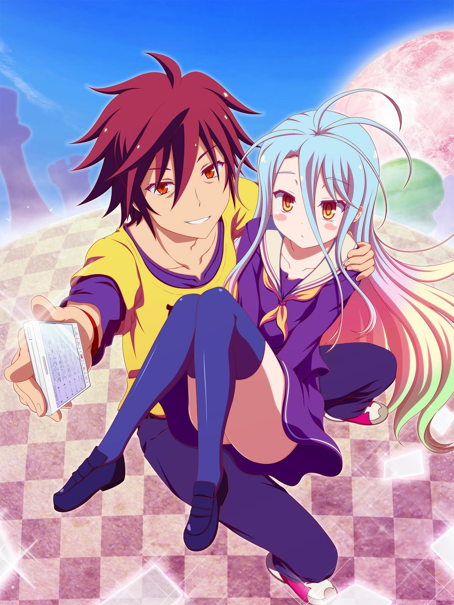

  

<h1 align="center">Hi there, I'm Roberto Landry</h1>

  <em>DevOps &nbsp;·&nbsp; Cloud &nbsp;·&nbsp; Cybersecurity</em>

---

## About Me

<table>
<tr>
<td valign="top" width="60%">

> *"Si tu ne travailles pas aussi dur que les autres, au moins travaille plus intelligemment."* — Shikamaru, Naruto

- ☁️ **Cloud Computing with AWS**
- 🔐 **Cybersecurity** with Fortinet
- 📱 **Web & Mobile Development**
- 🤝 Open to collaborating on online projects
- 📬 Reach me at **landry.ngueagho@facsciences-uy1.cm**

</td>
<td valign="top" width="40%" align="center">
  
</td>
</tr>
</table>

---

## Connect with Me

  
  

---

## Tech Stack

<table width="100%">
  <tr>
    <th>Cloud & Infrastructure</th>
    <th>Conteneurisation & Orchestration</th>
  </tr>
  <tr>
    <td align="center">
      
      
      
    </td>
    <td align="center">
      
      
    </td>
  </tr>
  <tr>
    <th>IaC & Automatisation</th>
    <th>Serveurs & Réseau</th>
  </tr>
  <tr>
    <td align="center">
      
      
    </td>
    <td align="center">
      
      
      
      
    </td>
  </tr>
  <tr>
    <th>Bases de données</th>
    <th>Gestion de projet</th>
  </tr>
  <tr>
    <td align="center">
      
      
      
      
    </td>
    <td align="center">
      
    </td>
  </tr>
</table>

---

## GitHub Stats

### Random Dev Quote

---

## Contribution Snake

<picture>
  <source media="(prefers-color-scheme: dark)" srcset="https://raw.githubusercontent.com/MohaElbadry/MohaElbadry/output/github-contribution-grid-snake-dark.svg">
  <source media="(prefers-color-scheme: light)" srcset="https://raw.githubusercontent.com/MohaElbadry/MohaElbadry/output/github-contribution-grid-snake.svg">
  
</picture>

---

## Contribution Graph

---

**Let's connect and build something amazing! 🚀**

